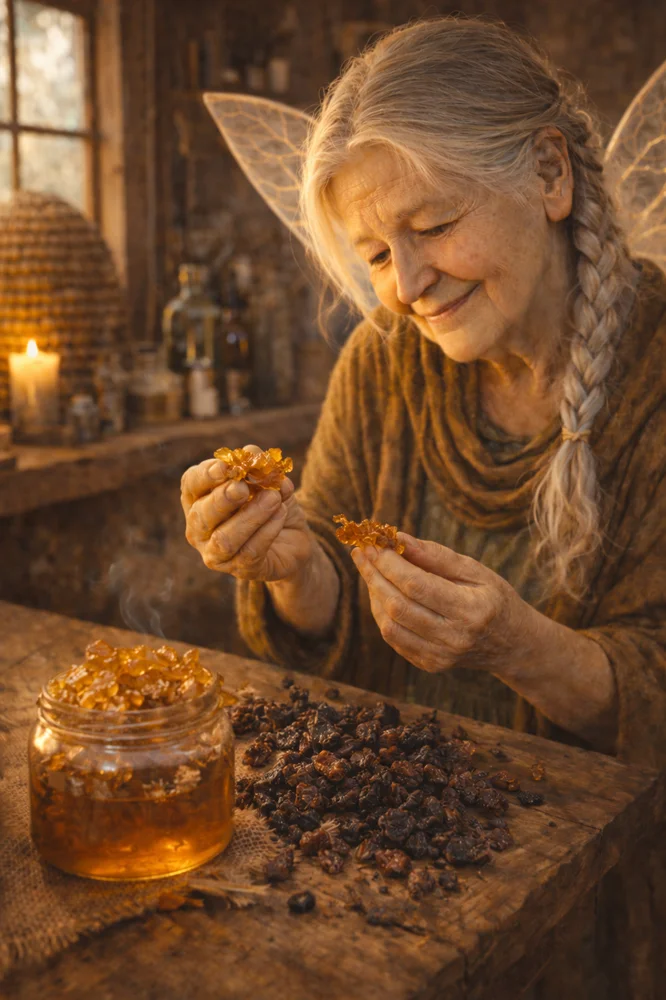

# Chapter 22: Resins and Extracts — Propolis, Myrrh, and Bloodroot

{ width=400 align=right }

Some of the most powerful botanical medicines for oral health aren't leaves or roots—they're sticky, resinous substances that plants and insects produce for protection. These concentrated materials pack intense biological activity into small doses.

In this chapter, we'll explore three such substances: propolis (from bees), myrrh (from trees), and bloodroot (a cautionary tale about the line between medicine and poison).

## Propolis: The Bee's Pharmacy

Propolis is a remarkable substance. Bees collect resins from tree buds and bark, mix them with wax and their own secretions, and use the resulting material to seal their hives, coat interior surfaces, and protect against invaders—both physical and microbial.[^1]

A beehive is one of the most hygienic environments in nature, despite being warm, moist, and containing concentrated food sources. Propolis is a major reason why. The bees are essentially applying antimicrobial coating throughout their home.

Humans noticed this long ago. Propolis has been used medicinally since ancient Egypt (it was part of mummy preservation) and appears in the medical traditions of Greece, Rome, the Middle East, and Europe.[^2]

### The Chemistry

Propolis composition varies significantly based on the botanical sources bees have access to. European propolis (from poplar trees) differs from Brazilian propolis (from *Baccharis* species) differs from Asian propolis (various sources). Despite this variation, common bioactive compound classes include:

**Flavonoids:** Pinocembrin, galangin, chrysin, and others. These provide antimicrobial, antioxidant, and anti-inflammatory activity.

**Phenolic acids:** Caffeic acid, ferulic acid, and their esters (including CAPE—caffeic acid phenethyl ester, a potent anti-inflammatory).

**Terpenoids:** Various compounds with antimicrobial and anti-inflammatory effects.

**Balsams and resins:** Complex mixtures providing the sticky, sealing properties.

### Mechanisms for Oral Health

**Broad-spectrum antimicrobial:** Propolis is active against bacteria (gram-positive and gram-negative), fungi (*Candida* species), and even some viruses. For oral health, it has demonstrated activity against *S. mutans*, *P. gingivalis*, *Candida albicans*, and other oral pathogens.[^3]

**Biofilm inhibition:** Propolis interferes with bacterial adhesion and biofilm formation—critical for preventing plaque accumulation.

**Anti-inflammatory:** The flavonoids and phenolic acids in propolis modulate inflammatory pathways, potentially reducing gingival inflammation.

**Wound healing:** Propolis promotes tissue regeneration and accelerates wound closure—useful for oral ulcers and post-surgical healing.

### The Evidence

Propolis has a relatively robust evidence base for oral health:

**Periodontal disease:** Multiple studies show propolis mouthwashes reduce plaque, reduce gingival inflammation, and improve periodontal probing depths. Some studies show effects comparable to chlorhexidine.[^4]

**Dental caries:** *In vitro* studies demonstrate activity against *S. mutans* and inhibition of the enzymes (*glucosyltransferases*) that produce the sticky biofilm matrix.

**Oral candidiasis:** Propolis shows antifungal activity against *Candida* species, with clinical studies supporting its use for oral thrush.

**Aphthous ulcers:** Studies suggest propolis accelerates healing of canker sores.

**Evidence level:** Moderate-strong. More clinical evidence than most botanicals, with consistent positive results across multiple applications.

### Practical Use

**Propolis tincture:** The most common form. Propolis is dissolved in alcohol (typically 70-95%), creating a concentrated liquid. Look for products with 30-40% propolis content.

*For mouth rinse:* Add 10-20 drops of propolis tincture to your salt/baking soda rinse or to warm water. The resinous compounds won't fully dissolve but will disperse. Swish for 30-60 seconds.

*For direct application:* Apply a few drops of tincture directly to canker sores, inflamed gums, or healing wounds. The alcohol will sting briefly; the propolis will provide ongoing antimicrobial and healing support.

**Propolis spray:** Some products come in spray form for convenient oral application.

**Propolis in toothpaste:** Several brands incorporate propolis extract.

**Cautions:**

- Propolis can cause allergic reactions, particularly in people allergic to bee stings, honey, or related substances
- Patch test first if you have any history of bee-related allergies
- The alcohol in tinctures may irritate open wounds—dilute if needed

## Myrrh (*Commiphora myrrha* and related species)

Myrrh is one of humanity's oldest medicines. It's mentioned in Egyptian papyri, the Hebrew Bible, the Quran, and traditional medicine systems from the Mediterranean to India. The Three Wise Men brought it as one of three precious gifts—alongside gold and frankincense.

Myrrh is an oleoresin—a mixture of volatile oils, resins, and gums—obtained by wounding the bark of *Commiphora* trees and collecting the dried exudate. The resulting yellowish-brown resinous tears have a distinctive bitter, aromatic quality.

### The Chemistry

**Terpenoids:** Furanodienes, including curzene and various furanosesquiterpenes. These provide antimicrobial and anti-inflammatory activity.

**Volatile oils:** Contribute to the aromatic quality and have some antimicrobial effects.

**Polysaccharides:** May have immunomodulating effects.

**Resins:** Provide the physical substance and may contribute to wound-sealing effects.

### Traditional Use for Oral Health

Myrrh has been used specifically for oral conditions for millennia:

- Mouth ulcers and sores
- Gum inflammation (gingivitis)
- Throat infections
- Dental pain

It appears in traditional European herbal formulas for oral health and is still used in German phytomedicine.

### The Evidence

**German Commission E:** Approved myrrh for "mild inflammations of the oral and pharyngeal mucosa." This is notable given Germany's rigorous standards.[^5]

**Antimicrobial activity:** *In vitro* studies confirm activity against oral pathogens, though generally less potent than some other botanicals like thyme or propolis.

**Anti-inflammatory:** Myrrh demonstrates anti-inflammatory effects in laboratory studies.

**Clinical evidence:** Limited. Traditional use is extensive, but rigorous clinical trials specifically for oral health are sparse.

**Evidence level:** Moderate. Strong traditional evidence and regulatory approval in Germany; limited clinical trial data.

### Practical Use

**Myrrh tincture:** Similar to propolis, myrrh is commonly prepared as an alcohol tincture.

*For mouth rinse:* Add 10-15 drops to warm water and use as a rinse.

*For direct application:* Apply to inflamed gums or mouth sores.

**Myrrh powder:** The dried resin can be ground and mixed into toothpaste or applied directly.

**Commercial products:** Some European oral care products include myrrh extract. The German product "Parodontax" traditionally included myrrh among its botanical ingredients.

**Taste note:** Myrrh is intensely bitter. Some people find it unpleasant; others appreciate the "medicinal" quality. It's not a flavor you use for pleasure—it's a flavor you use because it works.

## Bloodroot (*Sanguinaria canadensis*): A Cautionary Tale

Now I need to tell you about a botanical that was once widely promoted for oral health—and then largely abandoned when problems emerged. This story illustrates why evidence matters and why "natural" doesn't mean "safe."

Bloodroot is a North American woodland plant with striking white flowers. Its rhizome contains a bright red-orange sap (hence "blood-root") that was used by Indigenous peoples for dye, ritual purposes, and medicine.

### The Active Compound: Sanguinarine

Sanguinarine is a benzophenanthridine alkaloid with potent antimicrobial and anti-plaque properties. In laboratory studies, it inhibits *S. mutans*, interferes with biofilm formation, and reduces plaque accumulation.

In the 1980s and 1990s, sanguinarine was incorporated into commercial oral care products—notably Viadent toothpaste and mouthwash. These products were marketed as "natural" alternatives with anti-plaque benefits.

### The Problem

Then reports began emerging of **oral leukoplakia**—white patches in the mouth that are considered pre-cancerous lesions—in long-term users of sanguinarine products.[^6]

Several studies found associations:

- Users of sanguinarine products had elevated rates of oral leukoplakia
- The lesions often occurred in areas of direct product contact (vestibule, where product pooled)
- Some lesions regressed after product discontinuation

The FDA eventually took action, and sanguinarine-containing products were largely withdrawn from the market.

### What This Teaches Us

**Natural doesn't mean safe.** Bloodroot is as natural as any plant, but sanguinarine at chronic exposure levels can damage oral tissue.

**Dose and duration matter.** Occasional, short-term use of many substances is safe while chronic, daily exposure causes harm. Sanguinarine may have been fine for the occasional use by traditional practitioners but became problematic as a twice-daily commercial product.

**Evidence takes time.** The anti-plaque effects of sanguinarine were real and validated. It took years of market use before the leukoplakia association became apparent.

**Traditional use has context.** Indigenous use of bloodroot was not as a daily oral care product but for specific, limited applications. That context matters.

### Current Status

Sanguinarine is largely absent from mainstream oral care products today. Some traditional herbalists still use bloodroot for specific applications, but it's not something I recommend for regular oral hygiene.

I include this discussion not to scare you away from botanicals—most of what we've discussed is quite safe—but to emphasize that evidence, dose, and context matter for everything, whether it grows in a forest or is synthesized in a laboratory.

## Using Resins Wisely

Propolis and myrrh remain valuable tools in the botanical oral health arsenal. They're concentrated, potent, and—when used appropriately—safe. Here are guidelines for incorporating them:

**Propolis:**

- Use in tincture form, added to rinses or applied directly
- 10-20 drops per rinse is typical
- Can be used regularly (several times per week) for maintenance
- Watch for allergic reactions, especially if you have bee allergies

**Myrrh:**

- Use in tincture form or as powder
- Best for acute inflammation or healing rather than daily maintenance
- Bitter taste limits tolerability for some people
- Use intermittently rather than continuously

**Bloodroot:**

- Avoid in oral care products
- Historical interest only

These resinous substances represent concentrated plant medicine. Unlike teas, which extract compounds into water at relatively low concentrations, tinctures and resins deliver higher doses. This makes them more potent—but also requires more caution.

Respect the potency, use them appropriately, and they can be powerful allies for oral health.

---

## Further Reading

For a detailed monograph on myrrh, see herbalist Richard Whelan's excellent reference:

- [Myrrh](https://www.rjwhelan.co.nz/herbs%20A-Z/myrrh.html) — Comprehensive profile including traditional uses, active constituents, and therapeutic applications

---

[^1]: [Propolis](https://en.wikipedia.org/wiki/Propolis) — Wikipedia. Bees produce propolis by mixing saliva and beeswax with exudate gathered from tree buds and sap flows.

[^2]: Sforcin, J. M., & Bankova, V. (2011). Propolis: Is there a potential for the development of new drugs? *Journal of Ethnopharmacology*, 133(2), 253-260. Documents propolis use from ancient Egypt through modern phytomedicine.

[^3]: Koo, H., et al. (2002). Effects of compounds found in propolis on *Streptococcus mutans* growth and on glucosyltransferase activity. *Antimicrobial Agents and Chemotherapy*, 46(5), 1302-1309.

[^4]: Agarwal, G., et al. (2019). Propolis and its potential in dentistry: A review. *Journal of Oral Biology and Craniofacial Research*, 9(2), 150-156. Meta-analysis showing propolis comparable to chlorhexidine for periodontal outcomes.

[^5]: [German Commission E](https://en.wikipedia.org/wiki/Commission_E) — Wikipedia. Germany's regulatory body for herbal medicines, known for rigorous evidence standards. Approved myrrh for oral and pharyngeal mucosal inflammation.

[^6]: Mascarenhas, A. K., et al. (2002). Use of a sanguinarine-containing toothpaste and development of oral leukoplakia. *Archives of Pediatrics & Adolescent Medicine*, 156(5), 461-466.
