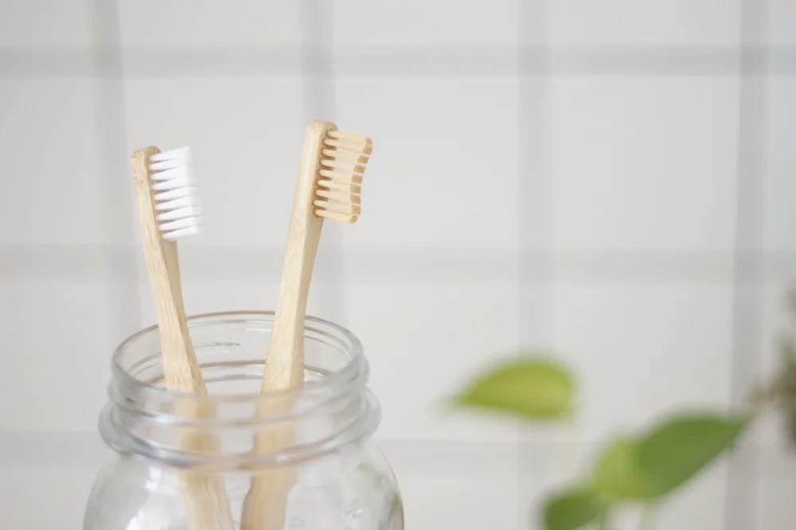

# Chapter 15: Mechanical Disruption

Before any rinse can work—before essential oils can contact bacteria, before baking soda can buffer pH, before salt can create osmotic stress—something has to happen first. The biofilm has to be disrupted.

[I introduced biofilms in Chapter 10](../enemies/biofilm-fortress.md), but let me revisit why they matter so much for delivery. Understanding this will transform how you think about oral hygiene.

## The Fortress Problem

When bacteria first land on your tooth surface, they're vulnerable. A single *S. mutans* cell sitting on enamel is exposed to saliva, to whatever rinse you're using, to the mechanical forces of your tongue and cheeks. At this stage, it's easy to dislodge, easy to kill.

But bacteria don't stay exposed for long.

Within hours of colonizing a surface, bacteria begin producing extracellular polymeric substance—EPS, also called the biofilm matrix. This is a sticky, slimy mixture of polysaccharides, proteins, and even DNA, extruded by the bacteria to create a protective environment.

The matrix does several things:

**Physical barrier:** The EPS is viscous, gel-like. Antimicrobial agents must diffuse through this gel to reach the bacteria embedded within. Concentrations drop rapidly with depth—what might be lethal at the surface becomes merely annoying a few micrometers down.

**Chemical protection:** The matrix can bind and neutralize antimicrobial compounds. Some positively charged agents get trapped by negatively charged matrix components. Some oxidizing agents get reduced before they reach their targets.

**Nutrient reservoir:** The matrix traps and concentrates nutrients, feeding the embedded bacteria even when the external environment is sparse.

**Communication hub:** The matrix facilitates quorum sensing—chemical communication between bacteria that allows them to coordinate behavior, including upregulating resistance genes.

The result is that bacteria in a mature biofilm can be 100 to 1,000 times more resistant to antimicrobial agents than the same bacteria in their planktonic (free-floating) state.[^1] That chlorhexidine mouthwash that kills *S. mutans* in a test tube? It's far less effective against *S. mutans* embedded in plaque.

## The Solution: Physical Disruption

This is why mechanical cleaning—brushing, flossing, and now water flossing—remains non-negotiable regardless of what rinses or products you use. You have to physically disrupt the biofilm to:

1. **Remove bulk biofilm mass:** Getting the bacteria and matrix off the tooth surface entirely
2. **Expose embedded bacteria:** Making them accessible to whatever antimicrobial forces you're deploying
3. **Restart the clock:** Biofilm begins forming again immediately, but fresh biofilm is less organized and less protective than mature biofilm

Let's talk about the main mechanical tools and what they actually accomplish.

## Brushing: The Workhorse

{ align=right width=400 }

The toothbrush—whether manual or powered—is still the foundation of mechanical biofilm disruption. Here's what actually matters:

### Duration Matters More Than Pressure

Most people brush for about 45 seconds.[^2] Dental recommendations call for 2 minutes minimum. This isn't arbitrary—it takes time to access all surfaces adequately.

Pressing harder doesn't compensate for rushing. In fact, aggressive brushing can:

- Cause gum recession
- Wear away enamel at the gumline (abrasion lesions)
- Miss areas entirely while focusing too intensely on others

The goal is gentle, thorough, systematic coverage—not intense scrubbing.

### Technique Matters

The "Modified Bass Technique"[^3] is what most dental professionals recommend:

1. Angle the brush 45 degrees toward the gumline
2. Use short, gentle back-and-forth strokes
3. Let bristles slip slightly under the gum margin
4. Cover all surfaces: outer (facial), inner (lingual), and chewing surfaces (occlusal)
5. Don't forget the tongue-facing surfaces of your front teeth

The 45-degree angle is important because it directs bristles into the gingival sulcus—the critical zone where gum disease often starts.

### Powered vs. Manual

Systematic reviews show that oscillating-rotating powered brushes (like Oral-B's) have a modest but consistent advantage over manual brushing for plaque removal and gingivitis reduction.[^4] Sonic brushes (like Philips Sonicare) also perform well.

The advantage isn't huge, but it's real. Powered brushes may particularly help people with limited manual dexterity, people who tend to brush too hard (many powered brushes have pressure sensors), and anyone who benefits from the built-in 2-minute timers.

That said, a well-used manual brush beats a poorly-used powered brush. Technique and duration matter more than the tool itself.

### When to Brush: The Acid Timing Question

Here's something counterintuitive: you shouldn't brush immediately after consuming acidic foods or beverages.

When you consume something acidic—citrus, wine, soda, tomato sauce—the enamel surface becomes temporarily softened. The acid has begun the demineralization process, creating a partially dissolved outer layer. Brushing at this moment can physically scrub away the softened enamel.

Wait 30 minutes.[^5] During that time, saliva will buffer the acid and begin remineralizing the softened surface. The enamel re-hardens, and brushing becomes safe again.

If you want to do something immediately after acidic exposure, rinse with plain water or a baking soda solution (to neutralize acid). Just don't brush.

## Flossing: The Interproximal Problem

Toothbrush bristles can't effectively reach between teeth. The contact areas where adjacent teeth touch, and the surfaces immediately below those contact areas, are essentially invisible to your brush. These interproximal surfaces are prime real estate for plaque accumulation and cavity formation.

This is why flossing (or interdental cleaning) matters.

### The Evidence for Flossing

I'll be honest with you: the evidence for flossing is weaker than you might expect, and this has led to misleading headlines claiming "flossing doesn't work."

Here's the nuance: clinical trials of flossing show inconsistent results, partly because most people don't floss correctly or consistently. When researchers observe actual flossing behavior, they find brief, ineffective technique. Trials that provide professional flossing (by hygienists) or intensive training show better results.

The mechanistic logic is sound: biofilm on interproximal surfaces causes disease; removing that biofilm should prevent disease. The problem is implementation, not concept.

### Flossing Technique

Effective flossing requires:

1. **Enough floss:** About 18 inches, with most wrapped around your middle fingers, leaving 1-2 inches to work with
2. **Gentle insertion:** Don't snap the floss down—this can cut gums. Ease it through the contact point.
3. **Curved technique:** Wrap the floss around one tooth in a C-shape, then slide up and down along the tooth surface, going slightly under the gum margin
4. **Both surfaces:** Each interproximal space has two tooth surfaces. Clean both before moving on.
5. **Fresh floss:** Advance to a clean section for each space

Most people just snap floss up and down between teeth without actually curving it against the tooth surfaces. This removes some debris but doesn't effectively disrupt the biofilm on the tooth itself.

### Alternatives to String Floss

If you struggle with traditional floss, alternatives exist:

**Interdental brushes:** Small bottle-brush-shaped tools that clean between teeth. Often more effective than floss for people with gaps between teeth or gum recession. Studies suggest they may be as effective or more effective than floss for many people.[^6]

**Floss picks:** Pre-threaded floss on a plastic handle. Easier to use than string floss, though the technique is still important. Better than not flossing.

**Water flossers:** We'll cover these extensively in the next chapter. They don't replace physical disruption entirely but can complement and, for some surfaces, substitute for string floss.

**Soft picks:** Rubber or silicone-tipped picks that massage between teeth. Gentler than interdental brushes, useful for sensitive gums.

The best interdental cleaning tool is the one you'll actually use consistently. A floss pick used daily beats string floss used twice a month.

## Tongue Cleaning

Your tongue is a bacterial reservoir. The dorsal surface (top) of the tongue is covered in papillae—tiny projections that create a landscape of peaks and valleys where bacteria accumulate. Tongue coating is a major contributor to halitosis and can reinfect cleaned teeth.

Cleaning your tongue can be done with:

**Tongue scrapers:** Dedicated tools, usually plastic or metal, that scrape the tongue surface. Pull from back to front with gentle pressure.

**Your toothbrush:** After brushing teeth, brush the tongue surface. Less effective than a dedicated scraper but better than nothing.

Tongue cleaning is particularly important if you struggle with bad breath. It's often more effective for halitosis than any mouthwash.

## The Sequence Question

People often ask: should I brush then floss, or floss then brush?

The traditional recommendation was brush first, floss second. The logic: brushing applies fluoride, and flossing afterward can help distribute fluoride-rich paste into interproximal areas.

However, some research suggests flossing first might be better. The logic: flossing loosens debris and disrupts biofilm, making the subsequent brushing more effective and allowing fluoride better access to surfaces.

Honestly, the difference is probably minimal. What matters is that you do both, consistently. Pick an order and stick with it so it becomes automatic.

**My suggestion:** Floss first, brush second, don't rinse with water after brushing (spit but leave fluoride residue). If you want to use your ecological rinse, use it at a different time—perhaps after a meal—so it doesn't wash away the fluoride.

## Mechanical Disruption as Prerequisite

The core message of this chapter is that mechanical disruption isn't optional. No rinse—no matter how cleverly formulated—can substitute for physically disrupting biofilm.

Think of it this way:

**Without mechanical disruption:** Your rinse contacts the outer surface of the biofilm matrix. Some antimicrobial compounds penetrate; most are blocked or neutralized. Bacteria deep in the biofilm are barely affected. You've inconvenienced the outer layer.

**With mechanical disruption:** You've torn apart the matrix, dislodged bacteria, exposed survivors to your rinse directly. The pH buffering reaches the tooth surface. The osmotic stress affects bacteria without their protective slime shield. Your rinse can actually do its job.

This is why the combination approach—mechanical disruption plus ecological rinses—is more than the sum of its parts. Neither alone is as effective as both together.

In the next chapter, we'll dive deep into water flossers—devices that combine mechanical disruption with solution delivery in a way that traditional methods can't match.

---

[^1]: Stewart, P. S., & Costerton, J. W. (2001). Antibiotic resistance of bacteria in biofilms. *The Lancet*, 358(9276), 135-138. Biofilm bacteria can tolerate antimicrobial concentrations 100-1,000 times higher than planktonic cells.

[^2]: 45 seconds is a commonly cited average brushing duration. The American Dental Association recommends brushing for two minutes, twice daily.

[^3]: [Bass technique](https://en.wikipedia.org/wiki/Bass_technique) — Wikipedia. A toothbrushing method developed by Dr. Charles Bass, designed to clean the gingival sulcus effectively using a 45-degree bristle angle.

[^4]: ["Powered toothbrushes compared to manual toothbrushes for maintaining oral health"](https://www.cochrane.org/CD002281/ORAL_powered-toothbrushes-compared-manual-toothbrushes-maintaining-oral-health) — Cochrane Systematic Review (2014). Found oscillating-rotating brushes reduce plaque 11% more and gingivitis 6% more than manual brushing.

[^5]: Attin, T., et al. (2004). Toothbrushing abrasion of softened enamel. *Caries Research*, 38(6), 567-571. Waiting at least 30 minutes after acid exposure allows salivary remineralization before brushing.

[^6]: Slot, D. E., et al. (2008). The efficacy of interdental brushes on plaque and parameters of periodontal inflammation. *International Journal of Dental Hygiene*, 6(4), 253-264. Interdental brushes showed greater plaque reduction than floss in accessible embrasures.
