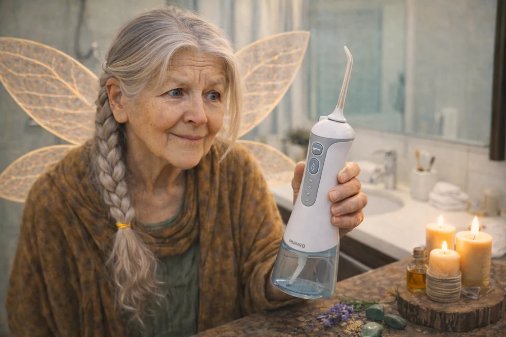

# Chapter 16: Water Flossers and Subgingival Reach

{ width=400 align=right }

The water flosser—branded as Waterpik by the company that pioneered the category—is a fascinating device. It's not a replacement for brushing. It's not exactly a replacement for flossing, though it comes closer. What it is, uniquely, is a delivery system.

It combines mechanical biofilm disruption with the ability to deliver whatever solution you put in the reservoir to places that passive rinsing cannot reach. Understanding how it works will help you use it more effectively—and help you understand why it pairs so well with the ecological rinses we've been discussing.

## The Physics of Pulsation

A water flosser isn't just squirting water at your teeth. If it were, you could accomplish the same thing with a sports bottle. The magic is in the pulsation.

Most water flossers operate at:[^1]

- **Pressure:** 10-100 PSI, with most use in the 50-80 PSI range
- **Frequency:** 1,200-1,400 pulses per minute
- **Flow rate:** 10-20 mL per second

The rapid pulsation creates a cycle of compression and decompression:

**Compression phase:** The pulse of high-pressure water impacts the tooth or gum surface. This creates shear forces—the water trying to move parallel to the surface while the surface resists. Biofilm, which is attached to the tooth, experiences stress at the attachment interface.

**Decompression phase:** As pressure drops between pulses, the biofilm—which is somewhat elastic—springs back. But not completely. Micro-tears have formed. Attachment points have weakened.

**Repeated cycling:** 1,200+ times per minute, this compression-decompression cycle accumulates fatigue stress. The biofilm progressively weakens, tears, and detaches in chunks.

This is more effective than steady pressure because biofilms are viscoelastic—they can deform under constant pressure without breaking. The pulsation prevents them from simply yielding; it forces them to repeatedly stress and release until they fail.

Additionally, the pulsation creates hydraulic turbulence in confined spaces. When the jet enters the interproximal space or the gingival sulcus, the pulsation creates chaotic, swirling flow patterns that contact surfaces a steady stream would miss.

## Subgingival Reach: How Deep Can You Go?

This is one of the most clinically relevant features of water flossers. Studies using tracer dyes have measured how far different oral hygiene methods penetrate into the gingival sulcus or periodontal pocket:[^2]

| Method | Typical Penetration |
|--------|---------------------|
| Passive rinsing (swishing) | ~1 mm |
| Standard water flosser at gumline | ~3-4 mm |
| Water flosser with specialized subgingival tip | ~6+ mm |

For context:

- **Healthy sulcus depth:** 1-3 mm
- **Early periodontal pockets:** 4-5 mm
- **Moderate-severe periodontitis:** 6+ mm

This means:

**In a healthy mouth:** A water flosser can deliver solution to the entire healthy sulcus—the critical zone where gingivitis begins. Passive rinsing cannot.

**In early periodontal disease:** A water flosser can access pockets that toothbrush and rinse cannot reach, potentially disrupting bacteria in zones that would otherwise be sanctuaries.

**In advanced periodontitis:** Specialized tips can reach quite deep, though professional intervention is still necessary for the deepest pockets.

This subgingival access is what makes water flossers particularly interesting as delivery systems for antimicrobial or ecological solutions. You're not just contacting surface biofilm; you're irrigating the very zones where periodontal disease progresses.

## The Evidence for Water Flossers

The research on water flossers generally supports their use, though with appropriate caveats:

### Strong Evidence

**Gingivitis reduction:** Multiple randomized controlled trials show that water flossers reduce gingival bleeding and inflammation indices.[^3] Several studies show superiority to string floss for these outcomes.

**Plaque reduction:** Consistent reductions in plaque scores, though the magnitude is modest. The effect is more pronounced at interproximal sites and along the gumline.

**Orthodontic patients:** Water flossers are particularly effective for people with braces, where traditional flossing is difficult. The jet can clean around brackets and wires.

**Implants:** Effective for cleaning around dental implants, where traditional floss can damage the delicate peri-implant seal.

### Moderate Evidence

**Periodontal pocket irrigation:** Using water flossers to deliver antimicrobial solutions into periodontal pockets shows promise as an adjunct to professional treatment. Not a substitute for scaling and root planing, but potentially helpful maintenance.

**Reduction in specific pathogens:** Some studies show decreases in periodontal pathogens (*P. gingivalis*, *A. actinomycetemcomitans*) in pocket samples after water flosser use.

### Limited Evidence

**Caries prevention:** Less studied. Water flossers are primarily about gingival health; the connection to cavity prevention is indirect (through improved overall oral hygiene).

**Superiority of medicated solutions:** Results are mixed on whether adding antimicrobial solutions to the reservoir improves outcomes compared to water alone. Some studies show benefit; others don't.

### A Cochrane Review Note

A Cochrane systematic review noted that while water flossers appear beneficial for gingivitis, the overall quality of evidence is moderate and more well-designed trials are needed.[^4] That said, the mechanistic rationale is sound, the devices are safe, and existing evidence trends positive.

## Technique Matters

Like any tool, water flossers work better with proper technique:

### Basic Technique

1. **Lean over the sink** with your mouth slightly open. Water will drip out continuously—this is normal and necessary. Don't try to keep your mouth closed.

2. **Start with low pressure** and increase gradually. Higher isn't always better; you want effective disruption without traumatizing tissue.

3. **Angle the tip at 90 degrees** to the tooth surface, aiming at the gumline. This directs the jet into the sulcus.

4. **Trace along the gumline** systematically—outer surfaces of upper teeth, inner surfaces of upper teeth, outer surfaces of lower teeth, inner surfaces of lower teeth.

5. **Pause at interproximal spaces.** These are the areas of greatest plaque accumulation. Let the jet work for a second or two between each pair of teeth.

6. **Do both sides.** Most people have a dominant side they favor. Consciously ensure you're giving equal time to both sides of the mouth.

7. **Typical duration:** 1-2 minutes covers the entire mouth adequately.

### Specialized Tips

Most water flosser systems come with multiple tip options:

**Standard jet tip:** Good for general use along the gumline and interproximal spaces.

**Orthodontic tip:** Has a small brush attached. Useful for cleaning around brackets.

**Plaque seeker tip:** Has three thin streams. May be more effective at disrupting biofilm in tight spaces.

**Periodontal/subgingival tip:** A softer, tapered tip designed to be placed directly into periodontal pockets. Use very low pressure with this tip.

For most people with healthy gums, the standard tip is sufficient. If you have periodontal pockets or specific concerns, consider specialized tips.

## Using Your Ecological Rinse in a Water Flosser

Now we get to the integration with everything you've learned. Your water flosser can deliver your salt/baking soda rinse—or a modified version—with superior penetration compared to passive swishing.

### Formulation Adjustments

The pressurized delivery means the solution is being *forced* into contact with tissue, including potentially sensitive sulcular epithelium. I recommend a **more dilute** mixture for water flosser use:

**For water flosser reservoir (approximately 15-20 oz capacity):**

- ¼ teaspoon salt
- ⅛ teaspoon baking soda
- Warm water to fill

This is about half the concentration of the swishing rinse. You're compensating with:

- Better delivery to target surfaces
- Longer contact time (1-2 minutes of irrigation vs. 30-60 seconds of swishing)
- Mechanical disruption occurring simultaneously

**What to leave out:**

- Calcium carbonate: The particles can clog jets. Leave it out of water flosser use.
- Essential oils: Unless very dilute and well-emulsified. Oil droplets can also clog the system and may leave residue.

### Post-Use Care

Salt solutions can be mildly corrosive to metal components over time, and mineral deposits can build up. After using your salt/baking soda solution:

1. Empty the remaining solution from the reservoir
2. Refill with plain warm water
3. Run for 10-15 seconds to flush the system
4. Empty completely

This takes an extra minute but extends the life of your device.

### The Two-Phase Approach

Consider this protocol for maximum effect:

**Phase 1: Water flosser with dilute rinse**
- Use the salt/baking soda solution in the reservoir
- Irrigate for 1-2 minutes
- Mechanical disruption + solution delivery

**Phase 2: Passive swish with full-strength rinse**
- Follow with your standard concentration rinse
- Now that biofilm is disrupted, the rinse can contact exposed surfaces
- 30-60 seconds, spit

This gives you the benefits of both pressurized delivery and passive soaking.

## When to Water Floss

**Before brushing:** Loosens debris and disrupts biofilm, making brushing more effective. Fluoride can then access cleaned surfaces.

**After eating (when you can't brush):** If you're at work or traveling and can't brush after lunch, water flossing removes bulk debris and mechanically disrupts new plaque formation.

**For gum problems:** If you're prone to gingivitis or have periodontal pockets, water flossing may be more important than standard flossing for you.

**Around dental work:** Implants, bridges, orthodontic brackets, and other dental hardware create cleaning challenges that water flossers handle well.

## Water Flossing vs. String Flossing

This isn't necessarily either/or. They do slightly different things:

**Water flossing advantages:**

- Better subgingival penetration
- Easier technique (less dexterity required)
- Can deliver solutions
- Better for orthodontics and implants
- More engaging (some people find it satisfying)

**String flossing advantages:**

- Scraping action against tooth surface (not just hydraulic disruption)
- No equipment required
- Portable
- Breaks interproximal biofilm through direct contact

**Ideal combination:** String floss for the physical scraping of interproximal surfaces, water flosser for subgingival irrigation and solution delivery. If you only do one, make sure you're doing it well.

## Contraindications and Cautions

**Use with care if:**

- You have acute periodontal infection (talk to your dentist first)
- You're immediately post-surgical in the mouth
- You have exposed root surfaces with sensitivity
- You have cardiac conditions requiring antibiotic prophylaxis for dental procedures (water flossing can cause transient bacteremia, though the clinical significance is unclear)

**Start gently:** If you've never used a water flosser, your gums may bleed at first.[^5] This is similar to the bleeding that occurs when you start flossing after a long hiatus—it indicates inflammation, not that you're doing harm. Stick with it; bleeding should decrease over 1-2 weeks as gingival health improves.

**Don't overdo pressure:** More pressure isn't always better. The goal is biofilm disruption and solution delivery, not sandblasting your gums.

---

In the next chapter, we'll put it all together—mechanical disruption, water flosser irrigation, your ecological rinses, and timing—into a coherent daily protocol.

---

[^1]: Typical specifications for countertop water flossers from major manufacturers (Waterpik, Philips). Portable units may operate at lower pressures.

[^2]: Cobb, C. M., et al. (1988). Ultrastructural examination of human periodontal pockets following the use of an oral irrigation device in vivo. *Journal of Periodontology*, 59(3), 155-163. Demonstrated subgingival penetration depths using tracer dyes.

[^3]: The effectiveness of a water flosser for reducing gingivitis has been demonstrated in multiple clinical trials. Barnes, C. M., et al. (2005). Comparison of irrigation to floss as an adjunct to toothbrushing. *Journal of Clinical Dentistry*, 16(1), 8-12.

[^4]: The Cochrane review on oral irrigators is less definitive than the individual trials, noting heterogeneity in study designs and outcomes. More standardized research is needed.

[^5]: Gingival bleeding on initiation of any interdental cleaning typically resolves within 1-2 weeks as inflammation decreases. Bleeding that persists beyond this suggests underlying periodontal issues requiring professional evaluation.
