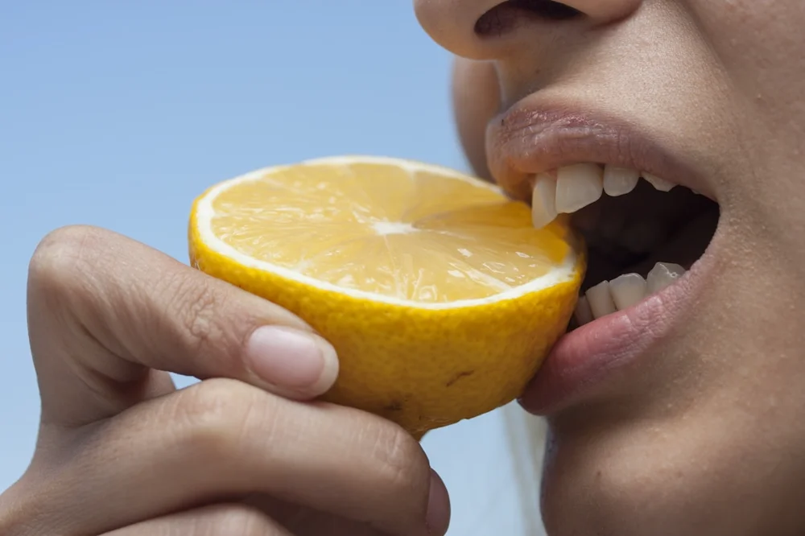

# Chapter 8: The Acid Equation

*In which we learn that pH alone doesn't tell the whole story, discover why your sparkling water habit probably isn't destroying your teeth, and understand the crucial difference between acid strength and buffering capacity*

---

Acid is the proximate cause of enamel demineralization. This is chemistry, not opinion. When hydrogen ions accumulate in the fluid surrounding your teeth, they drive the dissolution of hydroxyapatite. Below the critical pH, your enamel loses more mineral than it gains.

{ align=right width=400 }

But here's what the simple "acid is bad" message misses: **not all acid exposures are equally harmful.** The pH value on a label tells you only part of the story. To understand whether something is truly dangerous to your teeth, you need to understand buffering capacity, acid strength, and exposure patterns.

Let me clear up some confusion.

## pH vs. Buffering Capacity

**pH** measures the concentration of free hydrogen ions in a solution. It tells you how acidic the solution is *at this moment*.

**Buffering capacity** (also called titratable acidity) measures how much the solution resists pH change when you add a base. It tells you how much acid *in total* the solution contains, including acid that hasn't dissociated.

This distinction is crucial.

Imagine two drinks, both with a pH of 4.0:

**Drink A** is a weak acid solution with low buffering capacity. When saliva encounters it, the bicarbonate in saliva quickly neutralizes the small total acid load. pH rises back toward neutral within minutes.

**Drink B** is a strong acid solution with high buffering capacity. When saliva encounters it, the bicarbonate in saliva is overwhelmed. It takes much longer to neutralize the acid, and the pH stays low for an extended period.

Both drinks show the same number on a pH meter. But Drink B is far more erosive because it maintains the demineralization conditions for longer.

This is why carbonated water, despite its low pH, is much less erosive than fruit juice, despite similar pH values. Let's examine this more closely.

## The Carbonated Water Question

Sparkling water has a pH of roughly 3.5-4.5, depending on carbonation level. That sounds alarming—below the critical pH for enamel demineralization.

But carbonated water's acidity comes from **carbonic acid**, formed when CO₂ dissolves in water:

**CO₂ + H₂O ⇌ H₂CO₃ ⇌ H⁺ + HCO₃⁻**

Carbonic acid is:

1. **Weak:** It only partially dissociates. Most of the CO₂ stays as dissolved gas rather than producing hydrogen ions.

2. **Volatile:** CO₂ escapes from the solution readily. As you swallow sparkling water, the gas escapes, removing acid from the system.

3. **Low buffering capacity:** There's not much total acid present, so saliva can neutralize it quickly.

Multiple studies have confirmed that plain sparkling water has minimal erosive potential:

- A 2007 study in the *Journal of Oral Rehabilitation* found that sparkling mineral water was only slightly more erosive than still water and far less erosive than soft drinks or juices.[^1]
- A 2001 study found that unflavored carbonated water caused no more enamel dissolution than non-carbonated water over a 24-hour exposure period.[^2]

**The practical implication:** If you enjoy plain sparkling water, continue enjoying it without guilt. It's not a significant threat to your teeth.

**The caveat:** Many flavored sparkling waters contain added acids—most commonly **citric acid**—for tartness. Citric acid is not weak or volatile. It has high buffering capacity. A lemon-flavored sparkling water might be dramatically more erosive than plain sparkling water, despite similar carbonation.

Read ingredient labels. If you see citric acid, phosphoric acid, or malic acid listed, the erosive potential is much higher than plain carbonation would suggest.

## The Real Acid Threats

Let's survey common acid sources and their actual erosive potential:

### High Erosive Potential

**Citrus juices and fruits:** Orange juice, lemon juice, grapefruit. These contain citric acid at high concentrations with substantial buffering capacity. The pH is low (3.0-4.0), and the acid load is high. Regular consumption, especially sipping over extended periods, is genuinely erosive.

**Soft drinks and colas:** Phosphoric acid (in colas) and citric acid (in most others). pH around 2.5-3.5 with high buffering.[^3] Additionally, the sugar content feeds acid-producing bacteria, creating a double challenge. Diet sodas avoid the sugar problem but retain the acid problem.

**Sports and energy drinks:** Often highly acidic with added citric acid. pH values frequently below 3.0. Marketed for consumption during exercise, when saliva flow may be reduced.

**Wine:** pH 3.0-3.8, with tartaric and other organic acids. Red wine is slightly less acidic than white, but both are erosive with regular consumption.

**Vinegar-based foods and drinks:** Apple cider vinegar "health drinks," vinaigrette dressings, pickled foods. Acetic acid at significant concentrations.

### Moderate Erosive Potential

**Yogurt:** Lactic acid creates pH around 4.0-4.5, but the calcium and phosphate content partially offset the acid challenge. The dairy proteins may also provide some protection.

**Beer:** pH around 4.0-4.5, relatively low buffering. Less erosive than wine or soft drinks.

**Coffee:** pH around 5.0, with limited erosive potential at this level. Black coffee is minimally erosive; sweetened coffee is more concerning for the sugar than the acid.

**Tea:** pH varies (5.0-6.0 for most teas), generally low erosive potential. High tannin content may actually provide some protective effect.

### Low Erosive Potential

**Plain sparkling water:** As discussed, minimal concern.

**Milk:** pH around 6.5-6.8, near neutral. Calcium and phosphate content supports remineralization.

**Still water:** Neutral pH, no erosive potential.

**Cheese:** Mildly alkaline, actually helps neutralize acid and provides remineralization minerals.

## Erosion vs. Caries: Different Mechanisms

It's worth distinguishing between **erosion** (direct acid attack from dietary sources) and **caries** (acid from bacterial metabolism of sugars).

**Erosion** affects tooth surfaces that dietary acids contact directly. It causes smooth, generalized wear, particularly on the inside surfaces of front teeth (from acidic drinks) and the biting surfaces of molars. Severe erosion can make teeth appear smooth, glassy, and translucent.

**Caries** occurs where bacterial biofilm accumulates and where metabolic acid is produced locally. It creates localized lesions, typically in pits, fissures, and interproximal areas where plaque collects.

Some exposures cause both: sugary acidic drinks deliver acid directly (erosion) and feed bacteria that produce more acid (caries). This is why colas and fruit juices are particularly damaging.

Pure erosion—without the bacterial component—is better managed by reducing acid exposure rather than antimicrobial approaches. Reducing *S. mutans* won't help if the acid is coming directly from your diet.

## The Timing Factor

When you consume something acidic matters as much as what you consume.

**Immediately before bed:** This is the worst timing. Saliva flow drops dramatically during sleep, reducing acid clearance and buffering. An acidic food or drink consumed late at night sits with your teeth for hours with minimal protective saliva.

**Upon waking:** Morning mouth tends to be more acidic (bacteria have been active all night without much saliva). Adding dietary acid to an already low-pH environment extends the challenge.

**During meals:** Generally the best timing for acidic foods. Saliva flow is stimulated by chewing, buffering capacity is high, and other foods may help neutralize or buffer the acid.

**Between meals (sipping):** The most damaging pattern. Each sip resets the acid challenge, preventing pH recovery. Someone who sips a single soft drink over two hours exposes their teeth to far more cumulative acid stress than someone who drinks the same beverage in ten minutes.

## The Pattern That Matters

Let me illustrate with a practical example.

**Scenario A:** You have orange juice with breakfast, drinking a full glass in 5-10 minutes. Your mouth experiences one acid challenge, lasting perhaps 30 minutes until pH recovers. For the next several hours, you drink water and eat other foods, allowing complete recovery.

**Scenario B:** You have the same amount of orange juice, but you keep the glass on your desk and sip throughout the morning over 3 hours. Your mouth experiences continuous acid exposure the entire time, with no opportunity for pH recovery.

Scenario B is catastrophically worse than Scenario A, despite identical total acid consumption.

This is the pattern problem: **frequency and duration matter more than quantity.**

The person who has a large dessert after dinner once a day experiences less cumulative acid challenge than the person who snacks on small amounts of sugar hourly throughout the day. The person who drinks their coffee in 15 minutes does less damage than the person who nurses the same coffee for hours.

## Practical Principles

Given all this, here are evidence-based guidelines for managing dietary acid:

**1. Consolidate rather than spread.** If you're going to consume something acidic or sugary, do it in a defined time period rather than extended sipping or nibbling.

**2. Follow acid with neutralizers.** Water rinses away acid. Cheese provides alkaline minerals. Chewing xylitol gum stimulates saliva flow. Any of these after acidic food or drink accelerates pH recovery.

**3. Wait before brushing.** After significant acid exposure, enamel is softened and vulnerable to abrasion. Wait 30 minutes before brushing to allow remineralization to begin.[^4]

**4. Read labels on sparkling waters.** Plain carbonation is fine. Added citric acid is not.

**5. Avoid acid before bed.** Anything acidic in the hour before sleep will have extended effects due to reduced nighttime saliva.

**6. Consider using a straw.** For acidic drinks you choose to consume, a straw directs liquid past the teeth, reducing direct contact. Not a complete solution, but it helps.

**7. Don't swish acidic drinks.** Swishing spreads acid across all tooth surfaces and extends contact time. Drink and swallow; don't hold acidic beverages in your mouth.

## The Reassurance

If you've been worried about your sparkling water habit, I hope this chapter has provided some relief. Plain carbonated water is not a significant threat to dental health. The weak, volatile nature of carbonic acid means your saliva can handle it.

What you should watch for is the hidden acid in flavored beverages, the continuous sipping patterns that extend exposure, and the truly erosive substances like citrus juice and soft drinks that deliver real acid challenges.

Your teeth can handle occasional acid exposure. They've been doing it throughout evolutionary history. What they can't handle is continuous assault without time to recover.

Give them that time, and they'll repay you with resilience.

---

*Now let's talk about sugar—the fuel that bacteria convert to acid—and why the pattern of consumption matters more than the amount.*

---

[^1]: Parry, J., et al. (2001). Investigation of mineral waters and soft drinks in relation to dental erosion. *Journal of Oral Rehabilitation*, 28(8), 766-772.

[^2]: Rytömaa, I., et al. (1988). In vitro erosion of bovine enamel caused by acidic drinks and other foodstuffs. *Scandinavian Journal of Dental Research*, 96(4), 324-333.

[^3]: Reddy, A., et al. (2016). The pH of beverages in the United States. *Journal of the American Dental Association*, 147(4), 255-263. Colas typically have pH values between 2.4-2.7.

[^4]: Attin, T., et al. (2004). Toothbrushing abrasion of softened enamel after application of fluoride gels. *Caries Research*, 38(6), 567-571.
